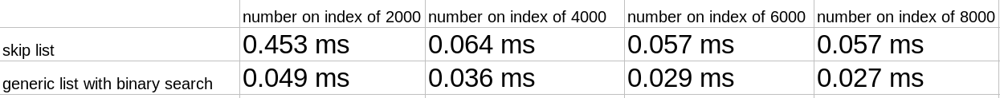
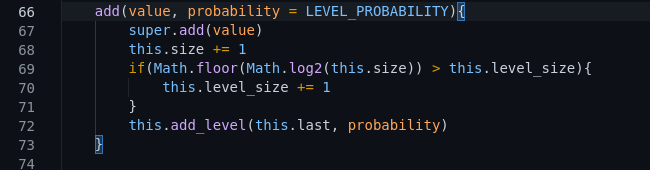
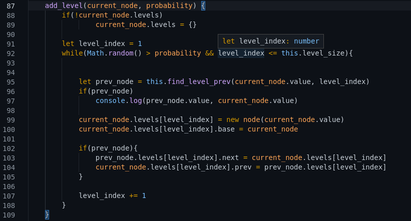
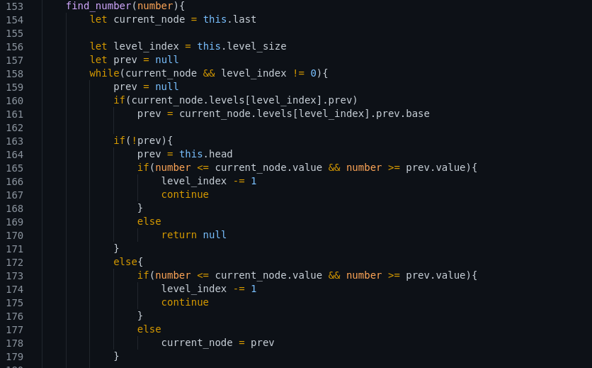
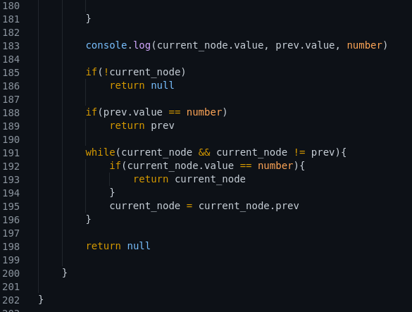

# Skip List
## 1.Intuition

Skip lists unite benefits of linked list and generic lists. We can add and delete an item in list with O(1) complexity like linked list. We can search an item with O( log(n) ) like generic lists with binary sort. If you have a dynamic data and also you need to search through them this data structure good for you.

Search function latiencies with 10000 random number list:

## 2.Code Review

Skip lists, extends basic linked list structure that store head and tail node 

When we add number to list, we change dynamically level size of list with "level_size = log(size)" formula. And we give probability of new generated node levels. For example if we created new node and our probability is 0,5. if random function gives as higher than 0,5 we create level-1 for this node. And we enter this loop again if random function gives us again higher than 0,5 we create level-2 but gives us less than 0,5 we end loop.

As we can explain in above example we loop until probability is less than given probability or level index less than max level size. When we create a new level we simply create a new node But we store base node that derive levels. And look previous nodes that have same levels because we need to connect them for search queries.

When we search a number start with highest level. And we pass through this level connected nodes until we find interval of searched number. If we find interval decrease level index and search number between this level index. Finally if we reach level index 0, that means basically we reach between two linked list nodes. We search between them. If number is found return node else return null.